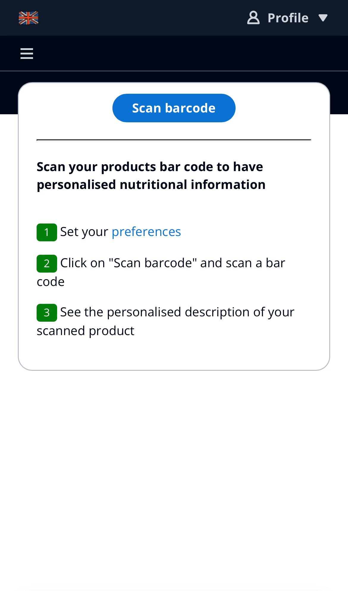
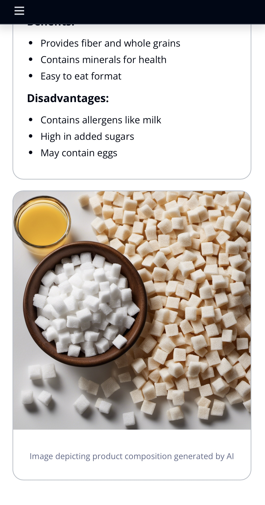
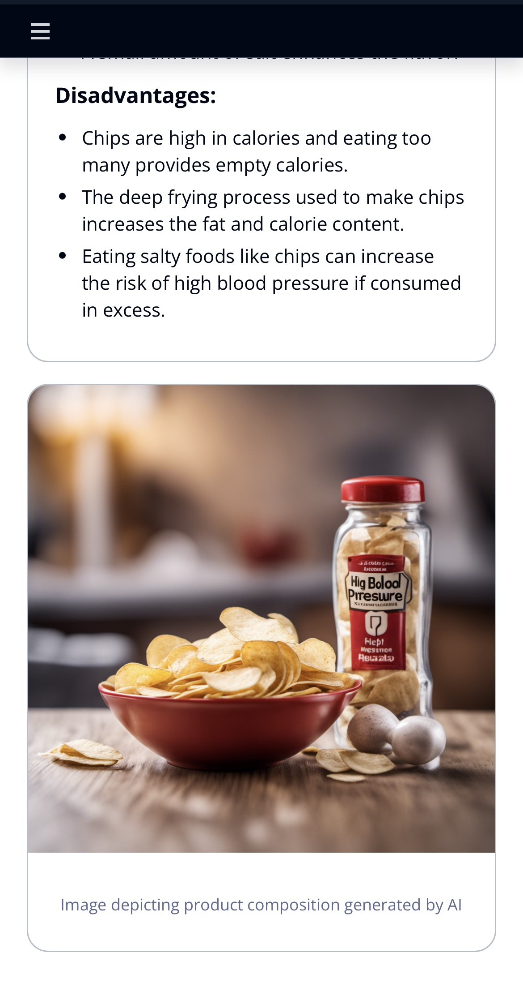
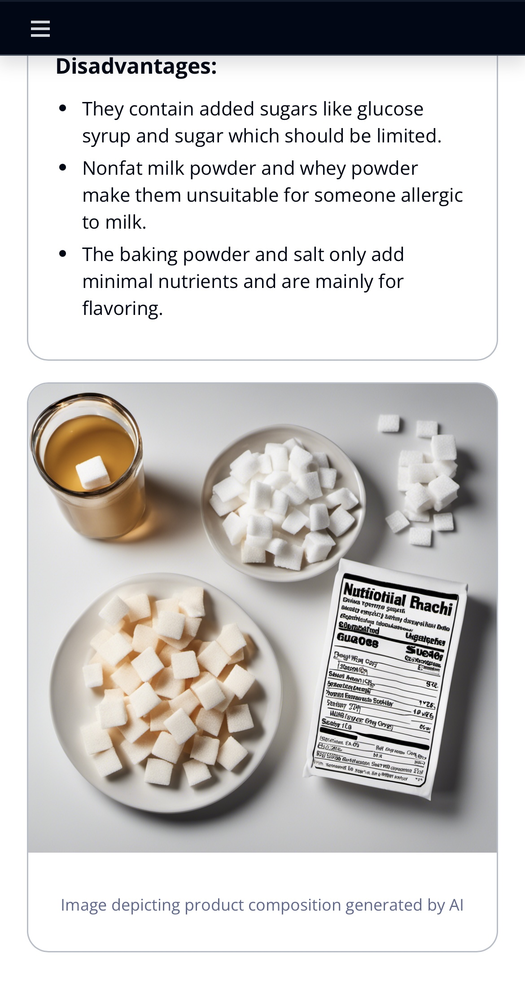

# Food analyzer app

**Food analyzer app** is a personalized GenAI nutritional webapp for your shopping and cooking recipes built with serverless architecture and generative AI capabilities. It was first created as the winner of the AWS Hackathon France 2024 and then introduced as a booth exhibit at the AWS Summit Paris 2024.

- Customers use their cell phone to scan a bar code of a product to get the explanations of the ingredients and nutritional information of a grocery product personalized with your allergies and diet.
- Customers can also take a picture of food products and discover 3 personalized recipes based on their food preferences.

The back-end of the app is made using AWS services such as:
- Amazon Cognito
- AWS LambdaURL
- Amazon DynamoDB
- Amazon S3
- Amazon Bedrock

The app is designed to have minimal code, be extensible, scalable, and cost-efficient. It uses Lazy Loading to reduce cost and ensure the best user experience.

We developed this exhibit to create an interactive serverless application using generative AI services. 


## Features overview

- **Personalized product information**: Curious about what is in a product and if it is good for you?
Just scan the barcode with the app for an explained list of ingredients/alergens and a personalized summary based on your preferences.

- **Personalized recipe generator**: Capture a photo of the ingredients in your fridge, and the app will generate recipes based on your preferences using those ingredients.


## Table of Contents

- [Architecture](#architecture)
- [Features](#features)
  - [Personalized product information](#personalized-product-information)
  - [Personalized recipe generator](#personalized-recipe-generator)
- [Key Functional Highlights](#key-functional-highlights)
- [Key Technical Features](#key-technical-features)
- [License](#license)


## Architecture 

The architecture of the application can be split in 4 blocks:

- Frontend and Auth
- Product Management
- Product Summary
- Recipe Generator


#### Frontend and Auth:

- **Implementation**: Using Amazon CloudFront, Amazon S3 for the static website, AWS IAM, Amazon Cognito for authentication.
- **Lambda URL Functions**: AWS Lambda ensured serverless computing, optimizing costs and enhancing overall performance.
- To protect the LambdaURLs, we used Amazon CloudFront secured with Lambda@Edge to authenticate with Amazon Cognito and signed requests.


#### Product Management:

- **Implementation**: Using AWS Lambda for server-side logic and a database from [Open Food Facts](https://fr.openfoodfacts.org/) accessed through APIs.

#### Product Summary and Generative Recipe:

- **Implementation**: Using AWS Lambda for server-side logic, Amazon Bedrock as a generative artificial intelligence (GenAI) building platform, Anthropic Claude as Large Language Models (LLM) and Stable Diffusion XL from StabilityAI as diffusion model for generating images.

- **AI Model Development**: Choosing the LLM model had an impact on response quality and latency. Ultimately, we chose Anthropic Claude 3 Haiku as a good ratio between latency and quality.

- **AI-Generated Images**: Prompting for an image is very sensitive and was a challenge to generate an image that truly highlights the nutritive features of products. To craft the prompt, we used a first LLM to generate the prompt based on product nutritive features. This technique is similar to a self-querying for vector databases. Using multi-shot prompt-engineering also helped a lot to improve the quality of the prompt.


## Features

### Personalized product information

<p align="center">
  
</p>

#### Bar code scanning

- **Strategy**: "Do not reinvent the wheel"

- **Implementation**: Bar code scanners have been there for a long time, we picked an open source library that was compatible with our stack. With time constraint, we did not spend much time on library comparison, focusing on having a working prototype rather than finding the perfect one. "Perfect is the enemy of good".

<p align="center">
  
</p>


#### Summary

- **Strategy**: Acknowledging the diversity of user preferences and dietary needs, our app incorporates a robust personalization feature. Beyond providing raw data, the app aims to educate users about the nutritional implications of their choices.

- **Implementation**: Users feel a sense of ownership and connection as the app tailors its insights to align with their individual health goals and dietary constraints. Incorporating concise and informative content within the app ensures that users understand the significance of various nutritional components. This educational aspect transforms the app into a learning tool, fostering a deeper connection with users seeking to enhance their nutritional literacy.

<p align="center">
  
  
  
</p>


#### AI-Generated Image as visual cues

- **Strategy**: To captivate users' attention and communicate key nutritional information effectively, our app employs AI-generated images.

- **Implementation**: Amazon Bedrock offers an out-of-the-box developer experience in generating visually striking representations of scanned products. If a product contains excessive sugar, for example, the AI image surrounds it with a visual depiction of sugar, serving as an engaging and memorable visual cue.


<p align="center">
  
  
  
</p>

### Personalized recipe generator


<p align="center">
  

</p>

#### Food aliment detection

- **Strategy**: Extract ingredients from the image, works well on fruits and vegetables.

- **Implementation**: We use Anthropic Claude 3 Sonnet on Amazon Bedrock with its vision capabilities to extract only food elements from the image. This allows us to focus on the food elements and ignore the background or other elements in the image. Claude 3 is a multi-modal model that can handle both text and images. The output is a list of ingredients present in the image.

- **Prompt Engineering**: To exploit the full potential of the model, we use a system prompt. A system prompt is a way to provide context, instructions, and guidelines to Claude before presenting it with a question or task. By using a system prompt, you can set the stage for the conversation, specifying Claude's role, personality, tone, or any other relevant information that will help it to better understand and respond to the user's input.

```python
  system_prompt="You have perfect vision and pay great attention to ingredients in each picture, you are very good at detecting food ingredients on images"
```

<p align="center">
  
  
</p>

#### Recipe proposal

- **Strategy**: Generate 3 recipes from ingredients matched in the pictures:
  - Easy recipe with few ingredients and made in less than 15 minutes
  - Medium recipe with more ingredients and intermediate complexity
  - Hard recipe with even more ingredients and high complexity.
Each recipe must also respect the user's dietary restrictions and allergies.

- **Implementation**: We use Claude 3 Sonnet to generate the 3 recipes. Each recipe contains the following JSON information:

```json 
{
      "recipe_title": "Succulent Grilled Cheese Sandwich",
      "description": "A classic comforting and flavorful dish, perfect for a quick meal",
      "difficulty": "easy",
      "ingredients": ["bread", "cheese", "butter"],
      "additional_ingredients": ["ham", "tomato"],
      "preparation_time": 5,
      "cooking_time": 6
}
```

- **Image Generation**: Once we have the recipe title and description, we use Stable Diffusion to generate the image of the recipe. We generate images in parallel to reduce the latency of the response.


<p align="center">
  
</p>

#### Step by step recipe

- **Strategy**: Generate a step by step recipe for the user to follow.

- **Implementation**: We use Anthropic Claude 3 Haiku on Amazon Bedrock to generate the step by step recipe. The steps are streamed to the user to reduce the latency of the response, we leverage lambda URL streaming. This method ensures smoother access to text content, improving user experience and interaction.

The output format is a Markdown file to faciliate the display of the recipe on the website. It also greatly simplifies the parsing of the recipe by the front-end when using streaming mode.

<p align="center">
  
</p>


## Key Functional Highlights

**Picking the Right AI Model**

- **Challenge**: The selection of the Language Model (LM) significantly influenced both response latency and quality, posing a critical decision point.

- **Solution**: Following a comprehensive assessment of various models, we've chosen the following Anthropic Claude models for different components within the app:
  - **Barcode scanning image generation**: Utilizing Stable Diffusion XL.
  - **Recipe fridge photograph food aliment detection**: Utilizing Anthropic Claude 3 Sonnet to extract food ingredients from images.
  - **Recipe proposals, Product ingredients**: Leveraging Anthropic Claude 3 Sonnet. Sonnet was selected for cases where the output needed to be parsed for other tasks or displayed using HTML components.
  - **Product summary, and recipe steps**: Utilizing Anthropic Claude 3 Haiku was favored for enhancing user experience by displaying results in streaming mode, and because the output was solely intended for display, enabling us to designate the output type as markdown.

**Use Lazy Loading to reduce cost/bandwidth**

- **Challenge**: Generative AI is costly in price and bandwidth. We wanted to be frugal and efficient when running in packed events.

- **Solution**: Using Lazy loading with the key being the hash of the prompt allow us to reduce cost and deliver response faster.


**Prompt Engineering for AI Image Generation**

- **Challenge**: Crafting a prompt for generating AI images that effectively highlighted nutritional features posed a nuanced challenge.

- **Solution**: Leveraging a two-step approach, we utilized a first LLM to generate a prompt based on product nutritional features. This self-querying technique (akin to a self-querying process for a vector database) was complemented by incorporating multi-shot prompting. This method significantly improved the quality and relevance of the generated images, ensuring that users received visually compelling representations of product features.

**User Personalization Complexity**

- **Challenge**: Integrating personalized dietary preferences and restrictions into the model presented complexity.

- **Solution**: To enhance the LLM's understanding, we dynamically incorporated a header in our prompt containing personalized allergy and diet inputs. This approach significantly improved the accuracy and relevance of the LLM's responses, ensuring a tailored experience for users. Personalized prompts became a cornerstone in delivering precise and relevant information based on individual preferences.

**Multi language support**

- **Challenge**: Present the application in multiple languages

- **Solution**: The same prompt is utilized, but the LLM is instructed to generate the output in a specific language, catering to the user's language preference (English/French).


## Key Technical Features


**AWS Lambda URL & Amazon CloudFront**
- **Challenge**: Calling an LLM to execute some tasks in a request response mode can be slow.

- **Solution**: To address the 30-second timeout of an API Gateway endpoint, the selected approach involves utilizing an AWS Lambda URL via Amazon CloudFront. Within Amazon CloudFront, a Lambda@Edge function is triggered for each request, responsible for verifying user authentication against Amazon Cognito. If authentication is successful, the Lambda@Edge function signs the request to the Lambda URL (which utilizes `AWS_IAM` as the authentication method). While utilizing a Lambda URL offers a feasible solution, it's essential to acknowledge that opting for AWS AppSync presents an alternative offering additional benefits. AWS AppSync offers an alternative solution, featuring built-in authentication and authorization mechanisms that seamlessly meet these needs. However, for this demo app, we opted to use Lambda URL instead.

**Amazon Bedrock synchronous/asynchronous response**

- **Challenge**: Obtaining the response from Amazon Bedrock can occur either in a request/response mode or in a streaming mode, wherein the Lambda initiates streaming the response instead of awaiting the entire response to be generated.

- **Solution**: Some sections of the application operate in request/response mode (such as `Product ingredients description` or retrieving the three recipe proposals), while another part (`Product summary`, `Getting the Step-by-Step Recipe`) employs streaming mode to demonstrate both implementation methods.

**Illustrated Use Cases of the GenAi Application**

- **Text generation** - Amazon Bedrock utilizes Anthropic Claude 3 Haiku to generate the product summary.
- **Text to image** - Amazon Bedrock utilizes Stable Diffusion XL from StabilityAI to generate an image of the product.
- **Image to text** - Anthropic Claude 3 Sonnet is leveraged by Amazon Bedrock to identify food elements in the image.


## Installation

```sh
npm install
```

### Deploy

* For simplicity, deploy the stack in the `us-east-1` region.

```sh
cdk deploy
```

### Try it

#### Create a User

Before accessing the application, ensure you've established a user account in Amazon Cognito. To accomplish this, navigate to the AWS Console, then Amazon Cognito, and locate a user pool named something similar to `AuthenticationFoodAnalyzerUserPoolXXX`.

#### Access the App

Check the stack outputs for a URL resembling `Food analyzer app.domainName`. Paste this URL into your browser, log in with the previously created user, and start enjoying the app.

## Running locally

You can run this vite react app locally following these steps.

### 1. Deploy infrastructure to AWS

Follow [instructions above](#installation) to deploy the cdk app.

### 2. Obtain environment configuration

Grab the `aws-exports.json` from the Amazon CloudFront distribution endpoint you obtained from the CDK Output, and save it into `./resources/ui/public/` folder.

The URL is something like:

`https://dxxxxxxxxxxxx.cloudfront.net/aws-exports.json`

### 3. Run local dev server

```sh
cd resources/ui
npm run dev
```

## Requirements


- [Node JS 18+](https://nodejs.org/en/) must be installed on the deployment machine. ([Instructions](https://nodejs.org/en/download/))

- [AWS CLI 2+](https://docs.aws.amazon.com/cli/latest/userguide/cli-chap-welcome.html) must be installed on the deployment machine. ([Instructions](https://nodejs.org/en/download/))

- Request access to Anthropic Claude models and Stable Diffusion XL on Amazon Bedrock
  - Follow [these steps](https://docs.aws.amazon.com/bedrock/latest/userguide/model-access.html) to gain access to Claude and SDXL models used in this app

## Resources

- [A Journey into Crafting an Award-Winning Gen-AI Serverless App with AWS](https://www.linkedin.com/feed/update/urn:li:activity:7168621188091469826/)
- Building a personalized GenAI webapp | Serverless Office Hours [YouTube](https://www.youtube.com/watch?v=D1_ygMC-roc&t=2320s&ab_channel=ServerlessLand) | [Twitch](https://www.twitch.tv/videos/2145622183) | [LinkedIn](https://www.linkedin.com/events/buildingapersonalizedgenaiwebap7194410511076126720/theater/)

## License

This project is licensed under the MIT-0 License. See the [LICENSE](./LICENCE) file.      
